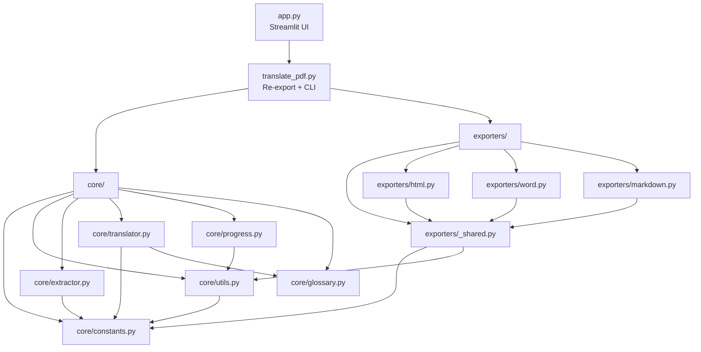

# Design Document: Module Refactor

## Overview

This design decomposes the monolithic `translate_pdf.py` (~2625 lines, 5 classes, 60+ functions) into a well-organized package structure grouped by responsibility domain. The refactoring introduces two Python packages (`core/` and `exporters/`) while preserving a backward-compatible re-export layer in `translate_pdf.py` so that both the CLI entry point and the Streamlit Web UI (`app.py`) continue to work without modification.

The key design principle is **zero behavioral change**: every public function and class retains its exact signature, return values, and side effects. The refactoring is purely structural.

### Goals

- Improve navigability: each file has a single responsibility domain
- Enable independent testing of each module
- Eliminate the need to read 2600+ lines to understand one concern
- Preserve all existing CLI arguments, progress files, and output formats
- Allow `app.py` imports to work unchanged via the re-export shim

### Non-Goals

- No new features or behavioral changes
- No API changes to public functions
- No dependency additions beyond the existing `requirements.txt`
- No changes to the Streamlit UI or Word/HTML/Markdown output format

## Architecture

### Target Directory Structure

```
DGtranslate/
├── core/
│   ├── __init__.py          # Re-exports all public symbols from submodules
│   ├── constants.py         # PROMPT_VERSION, EXTRACTOR_VERSION, format sets, prefixes
│   ├── utils.py             # Console config, path helpers, page-range normalization
│   ├── extractor.py         # PDFExtractor, ChapterDetector, HeadingInfo
│   ├── translator.py        # Translator, TokenStats, translate_batch_concurrent
│   ├── progress.py          # ProgressTracker, build_progress_metadata, compare_progress_metadata
│   └── glossary.py          # load_glossary, find_relevant_glossary_terms, report functions
├── exporters/
│   ├── __init__.py          # Re-exports write_html_output, write_word_output, write_markdown_output, paginate_translated_blocks
│   ├── _shared.py           # Shared text-processing helpers used by multiple exporters
│   ├── html.py              # write_html_output and HTML-specific helpers
│   ├── word.py              # write_word_output, HAS_DOCX, Word-specific helpers
│   └── markdown.py          # write_markdown_output and Markdown-specific helpers
├── translate_pdf.py         # Re-export layer + CLI entry point (main, translate_pdf, load_config)
├── app.py                   # Streamlit Web UI (unchanged)
├── tests/
│   ├── __init__.py
│   ├── test_utils.py
│   ├── test_glossary.py
│   ├── test_progress.py
│   ├── test_extractor.py
│   └── test_imports.py
└── ... (existing files unchanged)
```

### Dependency Graph



**Key constraint**: No circular dependencies. The dependency flow is strictly:
- `constants.py` depends on nothing (leaf node)
- `utils.py` depends only on `constants.py`
- Other core modules depend on `constants.py` and `utils.py` but not on each other (except `translator.py` → `glossary.py` for `find_relevant_glossary_terms`)
- `exporters/_shared.py` depends on `core/constants.py` and `core/utils.py`
- Each exporter depends on `exporters/_shared.py` but not on other exporters

## Components and Interfaces

### core/constants.py

Exports module-level constants used across the project:

```python
PROMPT_VERSION: str = "2026-05-15-preserve-layout-markers-v5"
EXTRACTOR_VERSION: str = "2026-05-15-card-sections-v2"
SUPPORTED_OUTPUT_FORMATS: set = {"markdown", "html", "word", "both", "all"}
TRANSLATION_FAILURE_PREFIX: str = "[Translation failed:"
```

No dependencies. No classes. No I/O.

### core/utils.py

Pure utility functions with minimal dependencies:

```python
def configure_console_output() -> None: ...
def ensure_output_parent(path: str) -> None: ...
def normalize_page_range(start_page, end_page, total_pages: int) -> tuple[int, int]: ...
def is_failed_translation(text: str) -> bool: ...
def parse_page_selection(selection: str, total_pages: int) -> set[int]: ...
def file_sha256(path: str) -> str: ...
```

Depends on: `core.constants` (for `TRANSLATION_FAILURE_PREFIX`)

### core/extractor.py

PDF text extraction and layout analysis:

```python
@dataclass
class HeadingInfo: ...

class ChapterDetector:
    def __init__(self) -> None: ...
    def analyze_page(self, page_num: int, page_dict: dict) -> None: ...
    def finalize(self) -> None: ...
    def get_toc_markdown(self) -> str: ...
    def get_heading_for_page(self, page_num: int) -> Optional[str]: ...

class PDFExtractor:
    def __init__(self, pdf_path: str) -> None: ...
    def extract_page(self, page_num: int) -> str: ...
    def detect_page_layout(self, page_num: int) -> str: ...
    def get_context_text(self, page_num: int) -> str: ...
    def get_layout_notes(self, page_num: int) -> list[str]: ...
    def finalize_chapters(self) -> None: ...
    def close(self) -> None: ...
    def __enter__(self): ...
    def __exit__(self, exc_type, exc, tb): ...
```

Depends on: `pymupdf`, `core.constants`

### core/translator.py

API client, prompt construction, retry logic, and batch concurrency:

```python
@dataclass
class TokenStats:
    def add(self, input_tok: int, output_tok: int, cached_tok: int = 0) -> None: ...
    def add_failure(self) -> None: ...
    def total_tokens(self) -> int: ...
    def cost_yuan(self) -> float: ...
    def summary(self) -> str: ...

class Translator:
    SYSTEM_PROMPT: str
    def __init__(self, api_key: str, model: str = "deepseek-v4-pro",
                 base_url: str = "https://api.deepseek.com", stats: TokenStats = None) -> None: ...
    def set_glossary(self, glossary: dict) -> None: ...
    def translate_chunk(self, text: str, page_num: int = None, prev_context: str = "") -> str: ...

def translate_batch_concurrent(pages_data, translator, tracker,
                               max_workers=4, progress_callback=None) -> dict: ...
```

Depends on: `openai`, `core.constants`, `core.glossary` (for `find_relevant_glossary_terms`)

### core/progress.py

Progress tracking with thread-safe persistence:

```python
def build_progress_metadata(pdf_path: str, glossary_path: Optional[str], model: str,
                            start_page: int, end_page: int) -> dict: ...
def compare_progress_metadata(expected: dict, actual: dict) -> list[str]: ...

class ProgressTracker:
    def __init__(self, progress_file: str, expected_metadata: Optional[dict] = None,
                 reuse_mismatched: bool = False) -> None: ...
    def save(self) -> None: ...
    def is_completed(self, page_num: int) -> bool: ...
    def mark_completed(self, page_num: int, translation: str) -> None: ...
    def clear_pages(self, page_nums) -> int: ...
    def get_translation(self, page_num: int) -> str: ...
```

Depends on: `core.utils` (for `file_sha256`)

### core/glossary.py

Glossary loading, term matching, and report generation:

```python
def load_glossary(glossary_path: str) -> dict: ...
def find_relevant_glossary_terms(text: str, glossary: dict) -> dict: ...
def build_glossary_report(pages_text: dict, glossary: dict, title: str = "") -> str: ...
def write_glossary_report(pages_text: dict, glossary: dict, report_output: str, title: str = "") -> None: ...
```

Depends on: `core.utils` (for `ensure_output_parent`)

### exporters/_shared.py

Shared text-processing helpers used by multiple exporter modules:

```python
def _split_translation_chunks(text: str) -> list[str]: ...
def _translation_blocks(translated_pages) -> list[dict]: ...
def _clean_translated_block(text: str) -> str: ...
def _clean_decorative_slash_line(line: str) -> str: ...
def _dedupe_adjacent_repeated_units(text: str) -> str: ...
def _visible_text_length(text: str) -> int: ...
def _is_markdown_heading(text: str) -> bool: ...
def _is_plain_heading_line(text: str) -> bool: ...
def _format_page_ranges(page_nums) -> str: ...
def paginate_translated_blocks(translated_pages, min_chars=1000, max_chars=1500,
                               page_layouts=None, split_on_layout=False) -> list[dict]: ...
```

Depends on: `core.constants`, `core.utils` (for `ensure_output_parent`)

### exporters/html.py

```python
def write_html_output(translated_pages, html_output: str, title: str,
                      subtitle: str = "中文翻译", ...) -> None: ...
# Plus HTML-specific internal helpers: _html_inline, _html_block, _html_table, etc.
```

Depends on: `exporters._shared`

### exporters/word.py

```python
HAS_DOCX: bool  # True if python-docx is importable

def set_section_columns(section, num=2, space_twips=720) -> None: ...
def set_cell_width(cell, width) -> None: ...
def remove_table_borders(table) -> None: ...
def set_section_page_layout(section, columns=1) -> None: ...
def set_running_header_footer(doc, title: str, ...) -> None: ...
def set_document_base_layout(doc, columns=1, ...) -> None: ...
def write_word_output(translated_pages, docx_output: str, title: str,
                      subtitle: str = "中文翻译", ...) -> None: ...
```

Depends on: `python-docx` (optional), `exporters._shared`

### exporters/markdown.py

```python
def write_markdown_output(translated_pages, md_output: str, title: str,
                          toc: str = "", min_chars=1000, max_chars=1500) -> None: ...
```

Depends on: `exporters._shared`

### translate_pdf.py (Re-Export Layer + CLI)

The refactored `translate_pdf.py` becomes a thin shim:

```python
# Re-export all public symbols for backward compatibility
from core import (
    PDFExtractor, ChapterDetector, HeadingInfo,
    Translator, TokenStats, translate_batch_concurrent,
    ProgressTracker, build_progress_metadata, compare_progress_metadata,
    load_glossary, find_relevant_glossary_terms, build_glossary_report, write_glossary_report,
    configure_console_output, ensure_output_parent, normalize_page_range,
    is_failed_translation, parse_page_selection, file_sha256,
    PROMPT_VERSION, EXTRACTOR_VERSION, SUPPORTED_OUTPUT_FORMATS, TRANSLATION_FAILURE_PREFIX,
)
from exporters import (
    write_html_output, write_word_output, write_markdown_output, paginate_translated_blocks,
)
from exporters.word import HAS_DOCX

# CLI orchestration functions remain here
def translate_pdf(...): ...
def load_config(config_path: str) -> dict: ...
def main(): ...

if __name__ == "__main__":
    main()
```

**Design decision**: The `translate_pdf()` orchestrator and `main()` CLI function remain in `translate_pdf.py` rather than moving to a separate module. Rationale: these functions coordinate all modules and represent the application's top-level entry point. Moving them would add indirection without improving testability.

## Data Models

### Progress File Schema (.progress.json)

```json
{
  "metadata": {
    "pdf_sha256": "abc123...",
    "glossary_sha256": "def456...",
    "model": "deepseek-v4-pro",
    "prompt_version": "2026-05-15-preserve-layout-markers-v5",
    "extractor_version": "2026-05-15-card-sections-v2",
    "start_page": 0,
    "end_page": 80,
    "schema": 1
  },
  "completed_pages": [0, 1, 2, 3, 5, 7],
  "translations": {
    "0": "## 第一章\n\n翻译内容...",
    "1": "继续翻译...",
    "3": "..."
  }
}
```

### Glossary File Schema (TSV)

```
# Comment lines start with #
English Term\tChinese Translation
Delta Green\t绿色三角洲
Handler\t管理者
```

### TokenStats Dataclass

```python
@dataclass
class TokenStats:
    input_tokens: int = 0
    output_tokens: int = 0
    cached_tokens: int = 0
    total_cost: float = 0.0
    failures: int = 0
```

### Translation Block (internal)

```python
{
    "source_page": int,  # Zero-based page number
    "text": str          # Cleaned translated Markdown text
}
```

### Reading Page (internal, from paginate_translated_blocks)

```python
{
    "layout": str,       # "columns" | "single" | "cards"
    "blocks": list[dict] # List of translation blocks
}
```

## Correctness Properties

*A property is a characteristic or behavior that should hold true across all valid executions of a system — essentially, a formal statement about what the system should do. Properties serve as the bridge between human-readable specifications and machine-verifiable correctness guarantees.*

### Property 1: Config precedence

*For any* combination of CLI arguments, config file values, and built-in defaults, the resolved value for each parameter SHALL equal the CLI argument if provided, otherwise the config file value if present, otherwise the built-in default.

**Validates: Requirements 3.2**

### Property 2: Output path derivation

*For any* valid PDF file path and output format choice, when no explicit output path is provided, the derived output path SHALL equal `{pdf_stem}_cn` with the appropriate extension (`.md`, `.html`, `.docx`) appended based on the selected format.

**Validates: Requirements 3.3**

### Property 3: Progress file round-trip

*For any* valid ProgressTracker state (a set of completed page numbers and a translations dict), saving to a file and loading from that file SHALL produce a ProgressTracker with identical `completed_pages` set and `translations` dict.

**Validates: Requirements 4.1, 4.2**

### Property 4: Metadata fingerprint determinism

*For any* given combination of PDF path, glossary path, model name, start page, and end page, calling `build_progress_metadata` twice with the same inputs SHALL produce identical metadata dictionaries containing all required fields (pdf_sha256, glossary_sha256, model, prompt_version, extractor_version, start_page, end_page, schema).

**Validates: Requirements 4.3**

### Property 5: Metadata mismatch detection

*For any* two metadata dictionaries where at least one field differs, `compare_progress_metadata` SHALL return a non-empty list of mismatch descriptions, and when loaded into ProgressTracker with `reuse_mismatched=False`, cached translations SHALL be discarded.

**Validates: Requirements 4.4**

### Property 6: Thread-safe progress tracking

*For any* set of distinct page numbers marked as completed concurrently from multiple threads, after all threads complete, the ProgressTracker SHALL contain every page number in its `completed_pages` set with no data loss.

**Validates: Requirements 4.5**

### Property 7: Concurrency limit

*For any* value of `max_workers` between 1 and 16, `translate_batch_concurrent` SHALL never execute more than `max_workers` concurrent API calls at any point in time.

**Validates: Requirements 6.4**

### Property 8: Glossary TSV parsing

*For any* valid TSV content consisting of tab-separated English→Chinese pairs (with optional comment lines starting with "#" and blank lines), `load_glossary` SHALL return a dictionary containing exactly the non-comment, non-blank entries with English terms as keys and Chinese translations as values.

**Validates: Requirements 7.2**

### Property 9: Glossary term matching — longest-match-first, non-overlapping

*For any* input text and glossary dictionary, `find_relevant_glossary_terms` SHALL return matched terms such that: (a) every returned term appears in the input text, (b) when multiple glossary terms overlap in the text, the longest match is selected, and (c) no two matched spans overlap.

**Validates: Requirements 7.4**

### Property 10: Glossary report structure

*For any* non-empty pages_text dictionary and non-empty glossary dictionary, `build_glossary_report` SHALL return a Markdown string containing three distinct sections: a per-term summary with page numbers, per-page glossary hits, and suspected unlisted proper nouns.

**Validates: Requirements 7.5**

### Property 11: Page range normalization

*For any* valid inputs where 0 ≤ start_page < total_pages and start_page < end_page ≤ total_pages, `normalize_page_range` SHALL return the tuple (start_page, end_page). *For any* invalid inputs (negative start, start ≥ total_pages, end ≤ start), `normalize_page_range` SHALL raise ValueError with a descriptive message.

**Validates: Requirements 9.2, 9.5**

### Property 12: is_failed_translation detection

*For any* string that starts with `TRANSLATION_FAILURE_PREFIX`, `is_failed_translation` SHALL return True. *For any* string that does not start with `TRANSLATION_FAILURE_PREFIX` (including empty strings), it SHALL return False.

**Validates: Requirements 9.2**

## Error Handling

### Import Errors

- **Missing pymupdf**: `core/extractor.py` raises `ImportError` at module level with installation instructions
- **Missing openai**: `core/translator.py` raises `ImportError` at module level with installation instructions
- **Missing python-docx**: `exporters/word.py` sets `HAS_DOCX = False` and `write_word_output` raises `RuntimeError` when called
- **Re-export layer**: If any core dependency fails to import (other than python-docx), the `ImportError` propagates with the original message indicating which package is missing

### Progress File Errors

- **Invalid JSON**: ProgressTracker discards file contents, starts with empty state, no exception raised
- **Unexpected root type**: Same as invalid JSON — discard and start fresh
- **File not found**: Start with empty state (normal first-run behavior)
- **Metadata mismatch**: Report mismatched fields, discard cached translations unless `reuse_mismatched=True`

### Translation Errors

- **API error**: Retry up to 3 times with increasing delay (5s, 10s, 15s)
- **Permanent failure**: Return failure-prefixed string, do not cache in ProgressTracker
- **Empty API response**: Treated as error, triggers retry

### File System Errors

- **Missing parent directory**: `ensure_output_parent` creates parent directories recursively
- **Glossary file missing/None**: `load_glossary` returns empty dict without exception
- **Report output directory missing**: `write_glossary_report` creates parent directory before writing

### CLI Errors

- **Missing PDF path**: Print diagnostic, exit with non-zero code
- **Missing API key**: Print diagnostic, exit with non-zero code
- **Invalid config JSON**: Print error message, exit with non-zero code
- **Invalid page range**: `normalize_page_range` raises `ValueError` with Chinese-language message

## Testing Strategy

### Test Framework

- **Framework**: pytest
- **Property-based testing**: hypothesis (Python PBT library)
- **Minimum iterations**: 100 per property test
- **Tag format**: `# Feature: module-refactor, Property {N}: {title}`

### Unit Tests (Example-Based)

| Module | Test File | Focus |
|--------|-----------|-------|
| `core/utils.py` | `tests/test_utils.py` | normalize_page_range boundary values, parse_page_selection conversion, is_failed_translation edge cases |
| `core/glossary.py` | `tests/test_glossary.py` | load_glossary with TSV parsing, comment/blank line skipping, empty/None path handling |
| `core/progress.py` | `tests/test_progress.py` | Save/load round-trip, metadata mismatch handling, invalid JSON recovery |
| `core/extractor.py` | `tests/test_extractor.py` | ChapterDetector heading analysis (mocked page dicts) |
| imports | `tests/test_imports.py` | All 15 symbols importable from translate_pdf, no circular imports |

### Property-Based Tests

Each correctness property above maps to a single hypothesis test:

| Property | Test Location | Generator Strategy |
|----------|---------------|-------------------|
| 1: Config precedence | `tests/test_utils.py` | Random dicts for config, random CLI arg subsets |
| 2: Output path derivation | `tests/test_utils.py` | Random filename stems, random format choices |
| 3: Progress round-trip | `tests/test_progress.py` | Random page sets, random translation strings |
| 4: Metadata determinism | `tests/test_progress.py` | Random file paths, model names, page ranges |
| 5: Mismatch detection | `tests/test_progress.py` | Pairs of metadata dicts with random field differences |
| 6: Thread-safe tracking | `tests/test_progress.py` | Random page number sets, concurrent thread count |
| 7: Concurrency limit | `tests/test_translator.py` | Random max_workers (1-16), mocked API |
| 8: Glossary TSV parsing | `tests/test_glossary.py` | Random term pairs with comments and blanks |
| 9: Term matching | `tests/test_glossary.py` | Random texts with embedded glossary terms |
| 10: Report structure | `tests/test_glossary.py` | Random pages_text and glossary dicts |
| 11: Page range normalization | `tests/test_utils.py` | Random (start, end, total) tuples |
| 12: is_failed_translation | `tests/test_utils.py` | Random strings with/without failure prefix |

### Integration Tests

- **Import smoke tests**: Verify all modules importable without error, no circular dependencies
- **Re-export verification**: Verify all 15 symbols in app.py's import statement resolve correctly
- **Output equivalence** (manual/CI): Compare outputs of refactored code against reference outputs from the monolithic version for a sample PDF

### Test Constraints

- Unit tests require no API keys, network access, or PDF files
- Glossary tests use in-memory dicts, not external files
- Progress tests use temporary files (cleaned up after test)
- Property tests configured with `@settings(max_examples=100)`
