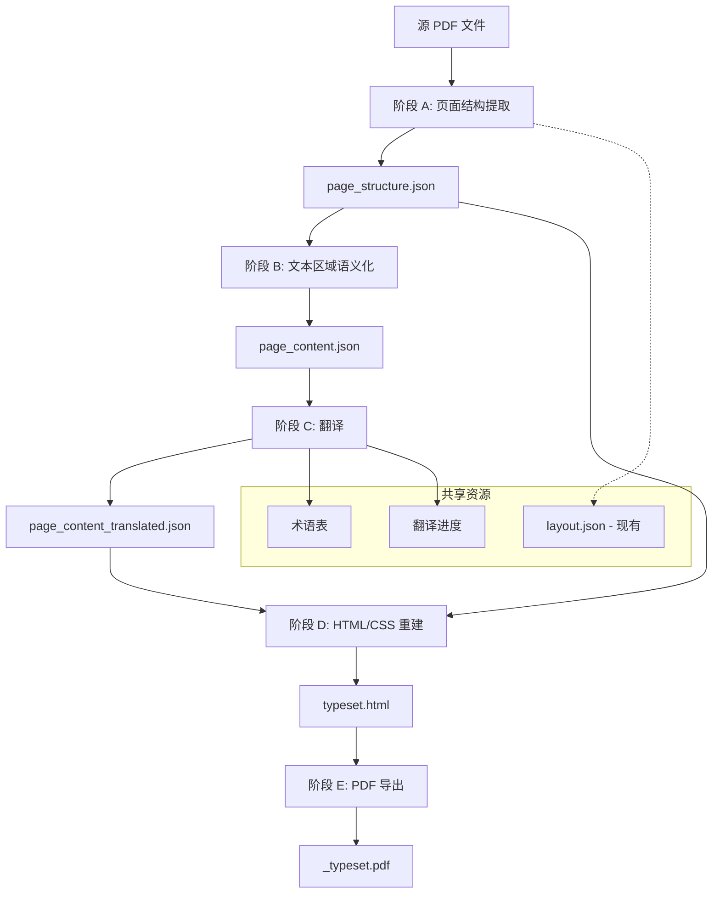
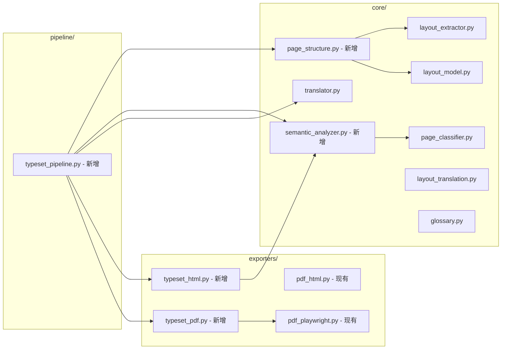
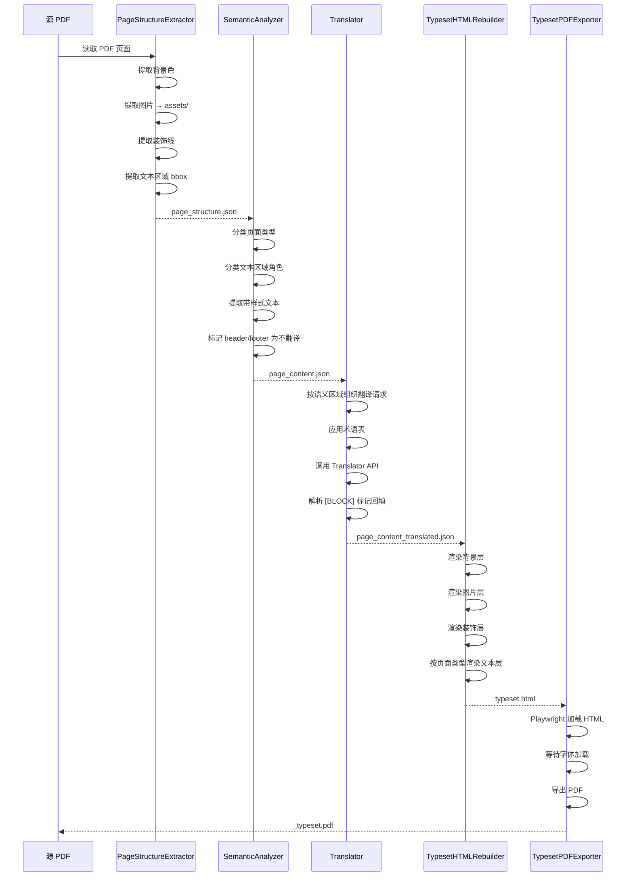
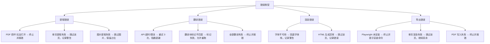

# Design Document: PDF Typeset Reflow

## Overview

本设计描述 TRPG PDF 翻译工具的"纯重绘"（typeset reflow）输出管线。与现有的 `_replica`（底图+遮罩+铺字）管线不同，纯重绘管线从 PDF 中提取所有视觉元素（背景、图片、装饰线、文本区域），用 HTML/CSS 从零重建每一页，使中文译文在 CSS 排版中自然流动，最终通过 Playwright 导出专业品质的中文排版 PDF。

### 设计目标

- 接近手工排版的中文 TRPG PDF 品质
- 中文文本自然换行，不再受原英文文本框尺寸限制
- 保留原 PDF 的视觉元素（背景色、图片、装饰线）
- 复用现有翻译、术语表、缓存和断点续跑能力
- 与现有 `_replica` 管线完全隔离，互不干扰

### 与现有系统的关系

- `_replica` 管线保留为"快速预览/检查稿"
- `_typeset` 管线作为"最终成品"
- 两者共享：布局提取结果、翻译进度文件、术语表

## Architecture

### 整体架构

纯重绘管线分为五个阶段（A-E），每个阶段独立运行，通过 JSON 中间文件传递数据：



### 模块关系图



## Components and Interfaces

### 阶段 A: 页面结构提取 (`core/page_structure.py`)

负责从 PDF 提取所有视觉元素，输出 `page_structure.json`。

```python
class PageStructureExtractor:
    """增强版页面结构提取器，提取背景、图片、装饰元素和文本区域。"""

    def __init__(self, pdf_path: str, output_dir: str):
        """
        Args:
            pdf_path: 源 PDF 文件路径
            output_dir: 输出目录（存放提取的图片资源）
        """

    def extract(self, start_page: int = 0, end_page: int | None = None) -> PageStructureDocument:
        """提取指定页面范围的结构。"""

    def extract_page(self, page_index: int) -> PageStructure:
        """提取单页结构，包括背景色、图片、装饰线和文本区域。"""

    def extract_background(self, page) -> BackgroundLayer:
        """提取页面背景色/渐变。"""

    def extract_images(self, page, page_index: int) -> list[ImageElement]:
        """提取独立图片，保存像素数据到 assets 目录。"""

    def extract_decorations(self, page) -> list[DecorationElement]:
        """提取矢量装饰元素（线条、框）。"""

    def extract_text_regions(self, page) -> list[TextRegionBBox]:
        """提取文本区域的边界框。"""
```

### 阶段 B: 文本区域语义化 (`core/semantic_analyzer.py`)

负责对文本区域进行语义分类，输出 `page_content.json`。

```python
class SemanticAnalyzer:
    """文本区域语义化分析器。"""

    def analyze_document(self, structure: PageStructureDocument) -> PageContentDocument:
        """分析整个文档的文本区域语义。"""

    def analyze_page(self, page_structure: PageStructure) -> PageContent:
        """分析单页的文本区域语义。"""

    def classify_region(self, region: TextRegionBBox, page_context: PageContext) -> SemanticRole:
        """
        将文本区域分类为语义角色。

        Returns:
            SemanticRole: body_column | title | header | footer | footnote | table | list
        """

    def classify_page_type(self, page_structure: PageStructure) -> PageType:
        """
        分类页面类型。复用现有 page_classifier.py 的逻辑。

        Returns:
            PageType: cover | art | columns | single | mixed
        """

    def extract_styled_text(self, region: TextRegionBBox) -> list[StyledTextRun]:
        """提取文本区域的带样式文本内容。"""
```

### 阶段 C: 翻译集成

复用现有 `core/translator.py` 和 `core/layout_translation.py`，不新增模块。

```python
# 翻译接口（复用现有）
def translate_typeset_content(
    content: PageContentDocument,
    translator: Translator,
    progress: TypesetTranslationProgress,
    glossary: dict,
    progress_callback=None,
) -> PageContentDocument:
    """
    按语义区域翻译文档内容。

    - 跳过 header/footer 等非翻译区域
    - 使用 [BLOCK] 标记保持区域对应
    - 支持断点续跑
    """
```

### 阶段 D: HTML/CSS 页面重建 (`exporters/typeset_html.py`)

负责将提取的结构和翻译后的文本组装为完整 HTML 页面。

```python
class TypesetHTMLRebuilder:
    """HTML/CSS 页面重建器。"""

    def __init__(self, config: TypesetConfig):
        """
        Args:
            config: 排版配置（字体、行距等）
        """

    def rebuild_document(
        self,
        structure: PageStructureDocument,
        content: PageContentDocument,
    ) -> str:
        """重建整个文档为 HTML 字符串。"""

    def rebuild_page(
        self,
        page_structure: PageStructure,
        page_content: PageContent,
    ) -> str:
        """重建单页为 HTML section。"""

    def render_background_layer(self, background: BackgroundLayer) -> str:
        """渲染背景层 HTML。"""

    def render_image_layer(self, images: list[ImageElement]) -> str:
        """渲染图片层 HTML，按原坐标放置。"""

    def render_decoration_layer(self, decorations: list[DecorationElement]) -> str:
        """渲染装饰元素层（CSS borders 或 SVG）。"""

    def render_text_layer(self, page_content: PageContent) -> str:
        """
        渲染文本层 HTML。
        - columns 页面：双栏 CSS 布局
        - single 页面：单栏 CSS 布局
        - cover 页面：居中大字布局
        """

    def render_column_layout(self, left_col: list[ContentBlock], right_col: list[ContentBlock]) -> str:
        """渲染双栏布局。"""

    def render_single_layout(self, blocks: list[ContentBlock]) -> str:
        """渲染单栏布局。"""
```

### 阶段 E: PDF 导出 (`exporters/typeset_pdf.py`)

复用现有 Playwright 导出能力，增加 typeset 专用配置。

```python
class TypesetPDFExporter:
    """Typeset PDF 导出器。"""

    def export(
        self,
        html_path: str,
        pdf_output: str,
        page_width_pt: float,
        page_height_pt: float,
    ) -> ExportResult:
        """
        使用 Playwright 将 HTML 渲染为 PDF。

        Returns:
            ExportResult: 包含成功页数、失败页和错误信息
        """

    def export_with_fallback(
        self,
        html_path: str,
        pdf_output: str,
        page_width_pt: float,
        page_height_pt: float,
    ) -> ExportResult:
        """
        导出 PDF，单页失败时跳过并继续。
        """
```

### 管线编排 (`core/typeset_pipeline.py`)

```python
@dataclass
class TypesetConfig:
    """纯重绘管线配置。"""
    font_family: str = "Noto Serif SC"
    fallback_fonts: list[str] = field(default_factory=lambda: ["Source Han Serif CN", "SimSun", "serif"])
    body_font_size_pt: float = 11.0
    min_body_font_size_pt: float = 10.0
    line_height: float = 1.6
    column_gap_pt: float = 20.0
    text_indent: str = "2em"

@dataclass
class TypesetResult:
    """管线执行结果。"""
    pdf_path: str | None
    html_path: str | None
    page_structure_path: str
    page_content_path: str
    total_pages: int
    translated_regions: int
    failed_regions: int
    export_errors: list[str]

class TypesetPipeline:
    """纯重绘管线编排器。"""

    def __init__(
        self,
        pdf_path: str,
        output_dir: str,
        translator: Translator,
        glossary: dict,
        config: TypesetConfig | None = None,
    ):
        """初始化管线。"""

    def run(self, start_page: int = 0, end_page: int | None = None,
            progress_callback=None) -> TypesetResult:
        """
        执行完整管线：提取 → 语义化 → 翻译 → HTML 重建 → PDF 导出。

        支持断点续跑：如果中间文件已存在且版本匹配，跳过对应阶段。
        """

    def run_phase_a(self) -> PageStructureDocument:
        """执行阶段 A：页面结构提取。"""

    def run_phase_b(self, structure: PageStructureDocument) -> PageContentDocument:
        """执行阶段 B：文本区域语义化。"""

    def run_phase_c(self, content: PageContentDocument) -> PageContentDocument:
        """执行阶段 C：翻译。"""

    def run_phase_d(self, structure: PageStructureDocument, content: PageContentDocument) -> str:
        """执行阶段 D：HTML 重建，返回 HTML 文件路径。"""

    def run_phase_e(self, html_path: str) -> str:
        """执行阶段 E：PDF 导出，返回 PDF 文件路径。"""
```

## Data Models

### page_structure.json 数据模型

```python
PAGE_STRUCTURE_SCHEMA_VERSION = 1

@dataclass(frozen=True)
class BackgroundLayer:
    """页面背景层。"""
    color: str | None          # CSS 颜色值，如 "#1a1a2e" 或 None（白色）
    gradient: str | None       # CSS 渐变值，如 "linear-gradient(...)" 或 None

@dataclass(frozen=True)
class ImageElement:
    """独立图片元素。"""
    id: str                    # 如 "p0001_img0001"
    bbox: list[float]          # [x0, y0, x1, y1] PDF 点坐标
    image_path: str            # 相对路径，如 "assets/typeset_images/p0001_img0001.png"
    width_px: int              # 图片像素宽度
    height_px: int             # 图片像素高度

@dataclass(frozen=True)
class DecorationElement:
    """矢量装饰元素（线条、框）。"""
    id: str                    # 如 "p0001_dec0001"
    element_type: str          # "line" | "rect" | "path"
    bbox: list[float]          # [x0, y0, x1, y1]
    stroke_color: str | None   # CSS 颜色值
    fill_color: str | None     # CSS 颜色值
    stroke_width: float        # 线宽（PDF 点）
    points: list[list[float]] | None  # 路径点（仅 path 类型）

@dataclass(frozen=True)
class TextRegionBBox:
    """文本区域边界框。"""
    id: str                    # 如 "p0001_r0001"
    bbox: list[float]          # [x0, y0, x1, y1]
    block_ids: list[str]       # 对应的 layout.json 文本块 ID 列表

@dataclass(frozen=True)
class PageStructure:
    """单页结构。"""
    page_index: int
    width: float               # 页面宽度（PDF 点）
    height: float              # 页面高度（PDF 点）
    background: BackgroundLayer
    images: list[ImageElement]
    decorations: list[DecorationElement]
    text_regions: list[TextRegionBBox]

@dataclass(frozen=True)
class PageStructureDocument:
    """整个文档的页面结构。"""
    schema_version: int
    source_pdf: str
    page_count: int
    pages: list[PageStructure]

    def to_json(self) -> str: ...

    @classmethod
    def from_json(cls, text: str) -> "PageStructureDocument": ...
```

### page_content.json 数据模型

```python
PAGE_CONTENT_SCHEMA_VERSION = 1

class SemanticRole(Enum):
    """文本区域语义角色。"""
    BODY_COLUMN = "body_column"
    TITLE = "title"
    HEADER = "header"
    FOOTER = "footer"
    FOOTNOTE = "footnote"
    TABLE = "table"
    LIST = "list"

class PageType(Enum):
    """页面类型（复用现有 page_classifier.py 定义）。"""
    COVER = "cover"
    ART = "art"
    COLUMNS = "columns"
    SINGLE = "single"
    MIXED = "mixed"

@dataclass(frozen=True)
class StyledTextRun:
    """带样式的文本片段。"""
    text: str
    font_size: float           # pt
    bold: bool
    italic: bool
    color: str                 # CSS 颜色值

@dataclass(frozen=True)
class ContentBlock:
    """语义化的内容块。"""
    id: str                    # 如 "p0001_r0001_b0001"
    region_id: str             # 对应 TextRegionBBox.id
    role: SemanticRole
    runs: list[StyledTextRun]  # 原文带样式文本
    source_text: str           # 纯文本（用于翻译）
    translated_text: str | None  # 翻译后的文本
    translatable: bool         # 是否需要翻译

@dataclass(frozen=True)
class ColumnInfo:
    """栏信息。"""
    side: str                  # "left" | "right"
    bbox: list[float]          # 栏的边界框
    block_ids: list[str]       # 属于该栏的 ContentBlock ID 列表

@dataclass(frozen=True)
class PageContent:
    """单页语义化内容。"""
    page_index: int
    page_type: PageType
    columns: list[ColumnInfo]  # 双栏页面的栏信息，非双栏为空
    blocks: list[ContentBlock]

@dataclass(frozen=True)
class PageContentDocument:
    """整个文档的语义化内容。"""
    schema_version: int
    source_pdf: str
    page_count: int
    pages: list[PageContent]

    def to_json(self) -> str: ...

    @classmethod
    def from_json(cls, text: str) -> "PageContentDocument": ...
```

### 数据流图



### 与现有模块的集成点

| 现有模块 | 集成方式 | 说明 |
| --- | --- | --- |
| `core/layout_extractor.py` | 复用 PyMuPDF 打开和页面遍历逻辑 | PageStructureExtractor 扩展其提取能力 |
| `core/layout_model.py` | 参考数据模型设计 | 新模型独立定义，但风格一致 |
| `core/page_classifier.py` | 直接调用 `classify_page()` | SemanticAnalyzer 复用页面分类逻辑 |
| `core/layout_translation.py` | 复用 `LayoutTranslationProgress` 模式 | 新增 `TypesetTranslationProgress` 类似实现 |
| `core/translator.py` | 直接使用 `Translator.translate_chunk()` | 翻译阶段直接调用 |
| `core/glossary.py` | 直接使用 `load_glossary()` | 术语表加载不变 |
| `exporters/pdf_playwright.py` | 复用 Playwright 导出逻辑 | TypesetPDFExporter 封装调用 |

## Correctness Properties

*A property is a characteristic or behavior that should hold true across all valid executions of a system—essentially, a formal statement about what the system should do. Properties serve as the bridge between human-readable specifications and machine-verifiable correctness guarantees.*

### Property 1: Page_Structure_JSON 序列化往返

*For any* valid `PageStructureDocument` object, serializing it to JSON and then deserializing the JSON back SHALL produce an equivalent data structure with identical field values.

**Validates: Requirements 11.5, 1.5, 1.6**

### Property 2: Page_Content_JSON 序列化往返

*For any* valid `PageContentDocument` object, serializing it to JSON and then deserializing the JSON back SHALL produce an equivalent data structure with identical field values.

**Validates: Requirements 11.6, 2.4**

### Property 3: 页面类型分类正确性

*For any* page with specific layout characteristics (minimal text + large images → art; centered large-font + few blocks → cover; blocks in two vertical columns → columns; full-width blocks only → single; both full-width and column blocks → mixed), the page classifier SHALL return the corresponding PageType.

**Validates: Requirements 3.1, 3.2, 3.3, 3.4, 3.5**

### Property 4: 语义角色分类有效性

*For any* text region analyzed by the SemanticAnalyzer, the returned classification SHALL always be one of the valid SemanticRole enum values (body_column, title, header, footer, footnote, table, list).

**Validates: Requirements 2.1**

### Property 5: 页眉页脚不可翻译标记

*For any* text region classified as SemanticRole.HEADER or SemanticRole.FOOTER, the resulting ContentBlock SHALL have `translatable = False`.

**Validates: Requirements 2.5**

### Property 6: HTML 页面尺寸保持

*For any* page with original dimensions (width, height), the generated HTML section SHALL have inline style dimensions that match the original page dimensions (converted to CSS pixels at 96/72 ratio).

**Validates: Requirements 5.1**

### Property 7: HTML 布局与页面类型匹配

*For any* page classified as PageType.COLUMNS, the generated HTML SHALL contain a dual-column CSS layout structure with two column containers and a gutter; for any page classified as PageType.SINGLE, the HTML SHALL contain a single-column layout structure.

**Validates: Requirements 5.4, 5.5, 6.1**

### Property 8: 图片坐标保持

*For any* page containing image elements, the generated HTML SHALL place each image element at CSS coordinates corresponding to its original PDF bounding box (converted at 96/72 ratio).

**Validates: Requirements 5.3, 9.1**

### Property 9: 视觉层级 z-order 不变量

*For any* generated HTML page containing background, image, and text layers, the z-index values SHALL satisfy: background layer < image layer < decoration layer < text layer.

**Validates: Requirements 9.3, 9.4**

### Property 10: 正文字号下限

*For any* body text element in the generated HTML, the computed font-size SHALL be no smaller than 10pt (equivalent to 13.333px at 96dpi).

**Validates: Requirements 5.7**

### Property 11: 标题检测一致性

*For any* text block whose original font size is ≥ 1.5× the page's body text font size, the generated HTML SHALL render it as a heading element (h2 or h3), not as a body paragraph.

**Validates: Requirements 6.3**

### Property 12: 样式提取完整性

*For any* text region containing text content, the SemanticAnalyzer's output SHALL include at least one StyledTextRun with all required fields populated: font_size > 0, color is a valid CSS color string, and bold/italic are boolean values.

**Validates: Requirements 2.2**

### Property 13: 双栏分离正确性

*For any* page containing two body columns, the SemanticAnalyzer SHALL produce exactly two ColumnInfo entries where the left column's bbox x-coordinates are all less than the right column's bbox x-coordinates, and every body_column ContentBlock is assigned to exactly one column.

**Validates: Requirements 2.3**

### Property 14: 翻译标记保持

*For any* set of content blocks sent for translation with [BLOCK id] markers, the parsed translation result SHALL contain exactly the same set of block IDs as the input, with no missing or extra IDs.

**Validates: Requirements 4.5**

### Property 15: 背景色渲染

*For any* page with a non-null background color in its PageStructure, the generated HTML section SHALL contain a CSS background-color property matching that color value.

**Validates: Requirements 5.2**

### Property 16: 装饰元素坐标保持

*For any* decorative element (line, rect) in a page's structure, the generated HTML SHALL contain a corresponding CSS border or SVG element positioned at coordinates matching the original bounding box.

**Validates: Requirements 9.2**

## Error Handling

### 错误分类与处理策略



### 错误处理原则

1. **可恢复错误**：单页/单块级别的失败不应终止整个管线
2. **不可恢复错误**：PDF 无法打开、Playwright 未安装、输出目录不可写等终止管线
3. **断点续跑**：翻译失败的区域记录在进度文件中，下次运行时自动重试
4. **错误报告**：每次运行生成 `_typeset_report.json`，包含每页状态和错误详情

### 具体错误处理

| 阶段 | 错误场景 | 处理方式 |
| --- | --- | --- |
| A | PDF 文件不存在或损坏 | 抛出 `FileNotFoundError` / `ValueError`，终止 |
| A | 单页图片提取失败 | 记录警告，该图片位置留空 |
| A | 矢量元素解析异常 | 跳过该元素，记录警告 |
| B | 文本区域无法分类 | 默认为 `body_column`，记录警告 |
| C | API 调用失败 | 重试 3 次，失败后标记该区域，继续其余 |
| C | 翻译结果块标记不匹配 | 标记该组所有块为失败 |
| D | 字体文件不存在 | 使用 fallback 字体栈，记录警告 |
| D | 单页 HTML 生成异常 | 跳过该页，记录错误 |
| E | Playwright 未安装 | 抛出 `RuntimeError`，提示安装命令 |
| E | 单页 PDF 渲染超时 | 跳过该页，记录页码和错误 |

### 进度文件格式

```json
{
  "schema": 1,
  "pipeline": "typeset",
  "translations": {
    "p0001_r0001_b0001": "翻译后的文本...",
    "p0001_r0001_b0002": "..."
  },
  "failed_blocks": {
    "p0002_r0001_b0001": "API timeout after 3 retries"
  },
  "translation_cache": {
    "sha256_hash": "cached translation..."
  },
  "completed_phases": ["A", "B"],
  "last_translated_page": 5
}
```

## Testing Strategy

### 测试框架

- **单元测试**：pytest（已安装）
- **属性测试**：hypothesis（需新增安装）
- **集成测试**：pytest + 真实 PDF 样本

### 属性测试配置

- 库：`hypothesis`
- 每个属性测试最少 100 次迭代
- 标签格式：`Feature: pdf-typeset-reflow, Property {number}: {property_text}`

### 测试分层

#### 属性测试（Property-Based Tests）

针对 Correctness Properties 中定义的 16 个属性，使用 hypothesis 生成随机输入验证：

| 属性 | 测试文件 | 生成器策略 |
| --- | --- | --- |
| P1: 结构 JSON 往返 | `tests/test_typeset_properties.py` | 生成随机 PageStructureDocument |
| P2: 内容 JSON 往返 | `tests/test_typeset_properties.py` | 生成随机 PageContentDocument |
| P3: 页面类型分类 | `tests/test_typeset_properties.py` | 生成特定布局特征的页面 |
| P4: 语义角色有效性 | `tests/test_typeset_properties.py` | 生成随机文本区域 |
| P5: 页眉页脚标记 | `tests/test_typeset_properties.py` | 生成 header/footer 区域 |
| P6: HTML 尺寸保持 | `tests/test_typeset_properties.py` | 生成随机页面尺寸 |
| P7: 布局类型匹配 | `tests/test_typeset_properties.py` | 生成不同类型页面 |
| P8: 图片坐标保持 | `tests/test_typeset_properties.py` | 生成随机图片位置 |
| P9: z-order 不变量 | `tests/test_typeset_properties.py` | 生成多层页面 |
| P10: 字号下限 | `tests/test_typeset_properties.py` | 生成随机字号 |
| P11: 标题检测 | `tests/test_typeset_properties.py` | 生成不同字号比例 |
| P12: 样式完整性 | `tests/test_typeset_properties.py` | 生成随机文本区域 |
| P13: 双栏分离 | `tests/test_typeset_properties.py` | 生成双栏页面 |
| P14: 翻译标记保持 | `tests/test_typeset_properties.py` | 生成随机块标记集 |
| P15: 背景色渲染 | `tests/test_typeset_properties.py` | 生成随机颜色 |
| P16: 装饰元素坐标 | `tests/test_typeset_properties.py` | 生成随机装饰元素 |

#### 单元测试（Example-Based Tests）

| 测试目标 | 测试文件 | 覆盖需求 |
| --- | --- | --- |
| 字体配置默认值 | `tests/test_typeset_config.py` | 10.1, 10.2, 10.3 |
| 文件命名后缀 | `tests/test_typeset_pipeline.py` | 7.4, 8.1 |
| 管线隔离 | `tests/test_typeset_pipeline.py` | 8.2, 8.3, 8.4 |
| 翻译缓存命中 | `tests/test_typeset_translation.py` | 4.3 |
| 翻译失败记录 | `tests/test_typeset_translation.py` | 4.4 |
| 断点续跑 | `tests/test_typeset_translation.py` | 4.6 |
| Schema 版本校验 | `tests/test_typeset_schema.py` | 11.3, 11.4 |
| JSON UTF-8 缩进 | `tests/test_typeset_schema.py` | 11.1, 11.2 |
| CSS 行距/缩进 | `tests/test_typeset_html.py` | 6.2, 6.4, 6.5 |
| 文本自然换行 | `tests/test_typeset_html.py` | 5.8 |
| 字体回退警告 | `tests/test_typeset_config.py` | 10.4 |

#### 集成测试

| 测试目标 | 测试文件 | 覆盖需求 |
| --- | --- | --- |
| 真实 PDF 图片提取 | `tests/test_typeset_integration.py` | 1.2, 1.3 |
| 真实 PDF 文本区域提取 | `tests/test_typeset_integration.py` | 1.4 |
| Playwright PDF 导出 | `tests/test_typeset_integration.py` | 7.1, 7.2, 7.3 |
| 单页渲染失败恢复 | `tests/test_typeset_integration.py` | 7.5 |
| Web UI 格式选择 | `tests/test_typeset_integration.py` | 8.5 |

### 测试数据策略

- **属性测试**：使用 hypothesis 策略生成随机但有效的数据模型实例
- **单元测试**：使用手工构造的最小数据结构
- **集成测试**：使用项目 `output/` 目录中已有的真实 PDF 样本（如 Presence PDF）

### 依赖新增

```
hypothesis>=6.100.0
```

