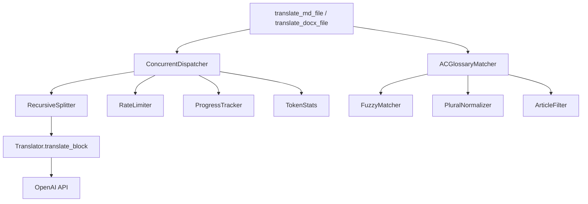
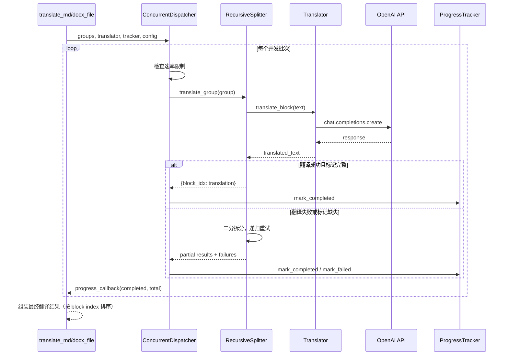

# Design Document: Translation Improvements

## Overview

本设计文档描述普通翻译管线（Markdown/Word 输入）的三项核心增强：递归任务拆分、AC 自动机术语匹配、并发翻译调度。这些改进将显著提高翻译成功率、术语匹配效率和整体吞吐量。

**设计目标：**
- 递归拆分：将当前"整组失败→逐块重试"的粗暴降级改为渐进式二分拆分，最大化保留已成功的翻译
- AC 自动机：将 O(m×n) 的逐条正则匹配替换为 O(n) 的多模式一次扫描，并增加 OCR 容错和形态归一化
- 并发调度：将当前的批次串行模式替换为带速率限制的真正并发调度器

**与现有代码的关系：**
- 递归拆分器包装在现有 `Translator` 重试逻辑之上，不修改 `Translator` 类本身
- AC 自动机替换 `core/glossary.py` 中的 `find_relevant_glossary_terms` 实现，保持相同接口
- 并发调度器替换 `translate_md.py` 和 `translate_docx.py` 中的翻译循环，保持函数签名不变

## Architecture

### 系统层次结构



### 数据流



### 模块部署位置

| 新模块 | 文件路径 | 职责 |
|--------|----------|------|
| RecursiveSplitter | `core/recursive_splitter.py` | 递归二分拆分与重试 |
| ACGlossaryMatcher | `core/glossary.py`（重构） | AC 自动机构建与匹配 |
| FuzzyMatcher | `core/glossary.py` | OCR 字符替换容错 |
| PluralNormalizer | `core/glossary.py` | 英文后缀归一化 |
| ArticleFilter | `core/glossary.py` | 冠词过滤 |
| ConcurrentDispatcher | `core/dispatcher.py` | 并发调度与速率限制 |
| RateLimiter | `core/dispatcher.py` | 令牌桶速率限制器 |

## Components and Interfaces

### 1. RecursiveSplitter (`core/recursive_splitter.py`)

```python
from dataclasses import dataclass
from typing import Callable, Protocol

class TranslateFunc(Protocol):
    """翻译函数签名，兼容 Translator.translate_block"""
    def __call__(self, text: str, block_index: int | None = None,
                 prev_context: str = "", source_type: str = "markdown",
                 cache=None) -> str: ...

class ParseFunc(Protocol):
    """解析函数签名，兼容 _parse_marked_md_translation"""
    def __call__(self, translated: str, group: list) -> dict[int, str]: ...

@dataclass
class SplitResult:
    """递归拆分的最终结果"""
    translations: dict[int, str]  # {block_index: translated_text}
    failed_indices: list[int]     # 最终失败的 block index 列表

def recursive_translate_group(
    group: list,
    translate_fn: TranslateFunc,
    parse_fn: ParseFunc,
    build_text_fn: Callable[[list], str],
    prev_context: str = "",
    source_type: str = "markdown",
    cache=None,
    max_depth: int = 10,
    progress_callback: Callable[[int, str], None] | None = None,
) -> SplitResult:
    """
    递归翻译一个 block group。
    
    流程：
    1. 尝试翻译整组（translate_fn 内部已有 3 次重试）
    2. 解析返回的 BLOCK 标记（parse_fn）
    3. 如果全部成功 → 返回
    4. 如果部分成功 → 保留成功部分，对缺失块递归
    5. 如果完全失败 → 二分拆分，对每半递归
    6. 递归深度超过 max_depth → 标记所有剩余块为失败
    """
    ...
```

**关键设计决策：**
- 拆分器不直接依赖 `MdBlock` 或 `DocxBlock` 类型，而是接受泛型 list + 函数参数，使其可同时服务 MD 和 DOCX 流程
- `build_text_fn` 负责将 block 列表序列化为 API 请求文本（带或不带 BLOCK 标记）
- 单块组不使用 BLOCK 标记（与现有行为一致），直接传原文
- 每次成功的子组翻译都立即通过 `progress_callback` 报告

### 2. ACGlossaryMatcher (`core/glossary.py` 重构)

```python
import ahocorasick  # pyahocorasick 库

class ACGlossaryMatcher:
    """基于 Aho-Corasick 自动机的术语匹配器"""
    
    def __init__(self, glossary: dict[str, str], *,
                 fuzzy: bool = False,
                 max_fuzzy_edits: int = 2,
                 normalize_plurals: bool = True,
                 filter_articles: bool = True):
        """
        构建 AC 自动机。每个翻译会话构建一次，跨所有块复用。
        
        Args:
            glossary: {english_term: chinese_translation}
            fuzzy: 是否启用 OCR 模糊匹配
            max_fuzzy_edits: 最大允许的 OCR 字符替换数
            normalize_plurals: 是否归一化英文复数后缀
            filter_articles: 是否忽略前置冠词
        """
        self._glossary = glossary
        self._automaton = ahocorasick.Automaton()
        self._fuzzy = fuzzy
        self._max_edits = max_fuzzy_edits
        self._normalize_plurals = normalize_plurals
        self._filter_articles = filter_articles
        self._build_automaton()
    
    def _build_automaton(self):
        """构建 AC 自动机，插入所有术语的小写形式"""
        for eng, chn in self._glossary.items():
            key = eng.lower()
            self._automaton.add_word(key, (eng, chn, len(eng)))
            # 如果启用复数归一化，也插入常见变体
            if self._normalize_plurals:
                for variant in self._generate_plural_variants(eng):
                    vkey = variant.lower()
                    if vkey != key:
                        self._automaton.add_word(vkey, (eng, chn, len(eng)))
        self._automaton.make_automaton()
    
    def find_relevant_glossary_terms(self, text: str) -> dict[str, str]:
        """
        兼容接口：返回 {english: chinese} 字典。
        与现有 find_relevant_glossary_terms(text, glossary) 结果一致。
        """
        ...
    
    def find_relevant_glossary_terms_annotated(self, text: str) -> list[GlossaryMatch]:
        """
        增强接口：返回带位置和模糊匹配注释的匹配列表。
        """
        ...
    
    @staticmethod
    def _generate_plural_variants(term: str) -> list[str]:
        """生成术语的复数/时态变体用于匹配"""
        variants = []
        if not term.endswith('s'):
            variants.append(term + 's')
        if not term.endswith('es'):
            variants.append(term + 'es')
        if term.endswith('y') and len(term) > 1 and term[-2] not in 'aeiou':
            variants.append(term[:-1] + 'ies')
        if not term.endswith('ed'):
            variants.append(term + 'ed')
        if not term.endswith('ing'):
            variants.append(term + 'ing')
        return variants

@dataclass
class GlossaryMatch:
    """单个术语匹配结果"""
    start: int              # 在源文本中的起始位置
    end: int                # 在源文本中的结束位置
    matched_text: str       # 实际匹配到的文本（可能是变体或 OCR 损坏形式）
    canonical_term: str     # 术语表中的标准英文形式
    chinese: str            # 中文翻译
    is_fuzzy: bool = False  # 是否为模糊匹配
    fuzzy_edits: int = 0    # OCR 替换字符数

class FuzzyMatcher:
    """OCR 字符替换模糊匹配器"""
    
    # OCR 常见替换对
    OCR_SUBSTITUTIONS = {
        '0': 'O', 'O': '0',
        '1': 'l', 'l': '1', 'I': '1', '1': 'I', 'l': 'I', 'I': 'l',
        '5': 'S', 'S': '5',
        '8': 'B', 'B': '8',
    }
    
    def __init__(self, max_edits: int = 2):
        self._max_edits = max_edits
    
    def is_fuzzy_match(self, candidate: str, target: str) -> tuple[bool, int]:
        """
        判断 candidate 是否为 target 的 OCR 损坏形式。
        返回 (是否匹配, 替换字符数)。
        """
        ...
```

**关键设计决策：**
- 使用 `pyahocorasick` 库（纯 C 实现，性能优秀）作为首选；备选 `ahocorasick-rs`（Rust 实现）
- AC 自动机在会话开始时构建一次，所有块共享同一实例
- 复数变体在构建时预计算并插入自动机，匹配时无需额外处理
- 模糊匹配作为第二遍扫描：先精确匹配，对未匹配区域再做模糊扫描
- 保持 `find_relevant_glossary_terms(text, glossary)` 全局函数作为向后兼容入口

### 3. ConcurrentDispatcher (`core/dispatcher.py`)

```python
import asyncio
import time
import threading
from concurrent.futures import ThreadPoolExecutor, Future
from dataclasses import dataclass, field

@dataclass
class DispatcherConfig:
    """并发调度器配置"""
    concurrency: int = 4          # 并行 API 调用数
    rate_limit: int = 60          # 每分钟最大调用数
    cooldown: float = 1.0         # 批次间冷却秒数
    max_split_depth: int = 10     # 递归拆分最大深度
    fuzzy_matching: bool = False  # 是否启用模糊术语匹配
    backoff_threshold: int = 10   # 连续失败触发暂停的阈值
    backoff_seconds: float = 30.0 # 暂停时长

class RateLimiter:
    """令牌桶速率限制器（线程安全）"""
    
    def __init__(self, calls_per_minute: int = 60):
        self._max_calls = calls_per_minute
        self._window_seconds = 60.0
        self._timestamps: list[float] = []
        self._lock = threading.Lock()
    
    def acquire(self) -> float:
        """
        获取一个调用许可。如果需要等待，返回等待秒数。
        调用者应在返回后 sleep 相应时间。
        """
        ...
    
    def wait_if_needed(self):
        """阻塞直到可以发起下一次调用"""
        ...

class ConcurrentDispatcher:
    """并发翻译调度器"""
    
    def __init__(self, config: DispatcherConfig, translator, tracker,
                 stats: TokenStats, progress_callback=None):
        self._config = config
        self._translator = translator
        self._tracker = tracker
        self._stats = stats
        self._progress_callback = progress_callback
        self._rate_limiter = RateLimiter(config.rate_limit)
        self._consecutive_failures = 0
        self._failure_lock = threading.Lock()
    
    def dispatch_all(
        self,
        groups: list[list],
        build_text_fn,
        parse_fn,
        source_type: str = "markdown",
    ) -> dict[int, str]:
        """
        调度所有翻译组的并发执行。
        
        返回 {block_index: translated_text} 按原始顺序排列。
        
        流程：
        1. 将 groups 分为顺序批次（每批 concurrency 个）
        2. 每批内并行执行，通过 RateLimiter 控制速率
        3. 失败的组交给 RecursiveSplitter 处理
        4. 批次间插入 cooldown
        5. 连续失败超过阈值时全局暂停
        6. 维护滑动上下文窗口（500 字符）
        """
        ...
    
    def _check_circuit_breaker(self):
        """检查是否需要触发熔断暂停"""
        with self._failure_lock:
            if self._consecutive_failures >= self._config.backoff_threshold:
                self._consecutive_failures = 0
                time.sleep(self._config.backoff_seconds)
    
    def _record_success(self):
        """记录成功，重置连续失败计数"""
        with self._failure_lock:
            self._consecutive_failures = 0
    
    def _record_failure(self):
        """记录失败"""
        with self._failure_lock:
            self._consecutive_failures += 1
```

**关键设计决策：**
- 使用 `ThreadPoolExecutor` 而非 `asyncio`，与现有代码风格一致（OpenAI SDK 是同步的）
- 速率限制使用滑动窗口令牌桶，而非固定窗口，避免窗口边界突发
- 上下文窗口在批次内按顺序传递：同一批次内的组共享上一批次最后完成的上下文
- 熔断机制：连续 10 次失败后暂停 30 秒，防止 API 限流导致雪崩
- 最终结果按 block index 排序，与现有行为一致

### 4. 集成点修改

**`translate_md.py` 修改：**
```python
# 替换现有的翻译循环
from core.dispatcher import ConcurrentDispatcher, DispatcherConfig
from core.recursive_splitter import recursive_translate_group

def translate_md_file(..., concurrency=4, rate_limit=60, cooldown=1.0,
                      max_split_depth=10, fuzzy_matching=False, ...):
    # ... 现有的提取和准备逻辑不变 ...
    
    config = DispatcherConfig(
        concurrency=max_workers,
        rate_limit=rate_limit,
        cooldown=cooldown,
        max_split_depth=max_split_depth,
        fuzzy_matching=fuzzy_matching,
    )
    dispatcher = ConcurrentDispatcher(config, translator, tracker, stats, progress_callback)
    translations = dispatcher.dispatch_all(
        groups, build_text_fn=_marked_md_group_text,
        parse_fn=_parse_marked_md_translation, source_type="markdown",
    )
    # ... 现有的输出逻辑不变 ...
```

**`translate_docx.py` 修改：** 同样替换翻译循环，使用 `ConcurrentDispatcher`。

**`core/glossary.py` 修改：**
```python
# 保留原函数签名作为向后兼容入口
_global_matcher: ACGlossaryMatcher | None = None

def build_glossary_matcher(glossary: dict, **kwargs) -> ACGlossaryMatcher:
    """构建 AC 自动机匹配器（每会话调用一次）"""
    return ACGlossaryMatcher(glossary, **kwargs)

def find_relevant_glossary_terms(text: str, glossary: dict,
                                  matcher: ACGlossaryMatcher | None = None) -> dict:
    """向后兼容接口。如果提供 matcher 则使用 AC 自动机，否则回退到旧逻辑。"""
    if matcher is not None:
        return matcher.find_relevant_glossary_terms(text)
    # 旧的正则逻辑作为 fallback
    return _find_relevant_glossary_terms_regex(text, glossary)
```

**`core/translator.py` 修改：**
```python
class Translator:
    def __init__(self, ..., glossary_matcher: ACGlossaryMatcher | None = None):
        self._glossary_matcher = glossary_matcher
    
    def _find_relevant_glossary_terms(self, text: str) -> dict:
        if self._glossary_matcher:
            return self._glossary_matcher.find_relevant_glossary_terms(text)
        return find_relevant_glossary_terms(text, self.glossary)
```

## Data Models

### DispatcherConfig

```python
@dataclass
class DispatcherConfig:
    concurrency: int = 4          # 1-64，并行 API 调用数
    rate_limit: int = 60          # 每分钟最大调用数
    cooldown: float = 1.0         # 批次间冷却秒数
    max_split_depth: int = 10     # 递归拆分最大深度
    fuzzy_matching: bool = False  # 是否启用模糊术语匹配
    backoff_threshold: int = 10   # 连续失败触发暂停的阈值
    backoff_seconds: float = 30.0 # 暂停时长
    
    def __post_init__(self):
        self.concurrency = max(1, min(64, self.concurrency))
        self.rate_limit = max(1, self.rate_limit)
        self.cooldown = max(0.0, self.cooldown)
        self.max_split_depth = max(1, min(20, self.max_split_depth))
```

### SplitResult

```python
@dataclass
class SplitResult:
    translations: dict[int, str]  # 成功翻译 {block_index: text}
    failed_indices: list[int]     # 最终失败的 block index
    split_count: int = 0          # 实际发生的拆分次数
    total_api_calls: int = 0      # 总 API 调用次数（含重试）
```

### GlossaryMatch

```python
@dataclass
class GlossaryMatch:
    start: int              # 源文本中起始位置
    end: int                # 源文本中结束位置
    matched_text: str       # 实际匹配文本
    canonical_term: str     # 标准术语
    chinese: str            # 中文翻译
    is_fuzzy: bool = False  # 是否模糊匹配
    fuzzy_edits: int = 0    # OCR 替换数
    match_type: str = "exact"  # exact | plural | article | fuzzy
```

### 配置文件扩展 (`config.example.json`)

```json
{
    "pdf": "THE MILLENNIUM.pdf",
    "api_key": "sk-...",
    "glossary": "glossary.tsv",
    "model": "deepseek-v4-pro",
    "workers": 32,
    "rate_limit": 60,
    "cooldown": 1.0,
    "max_split_depth": 10,
    "fuzzy_matching": false
}
```

## Correctness Properties

*A property is a characteristic or behavior that should hold true across all valid executions of a system — essentially, a formal statement about what the system should do. Properties serve as the bridge between human-readable specifications and machine-verifiable correctness guarantees.*

### Property 1: Split preserves all blocks

*For any* block group of size N ≥ 2, when the splitter performs a binary split, the two resulting sub-groups SHALL contain exactly the same blocks as the original group (no blocks lost or duplicated), and their combined size SHALL equal N.

**Validates: Requirements 1.1, 1.2**

### Property 2: Recursive termination at single-block level

*For any* block group where all translation attempts fail, the recursive splitter SHALL eventually produce only single-block sub-groups (size 1), and the total number of leaf-level groups SHALL equal the original group size.

**Validates: Requirements 1.3**

### Property 3: Split reassembly preserves ordering

*For any* block group that is recursively split and partially translated, the reassembled translations dictionary SHALL have keys ordered consistently with the original block indices (i.e., for any two blocks A and B where A.index < B.index, if both are in the result, they maintain their relative order).

**Validates: Requirements 1.5**

### Property 4: AC automaton oracle equivalence

*For any* glossary and any source text, the AC automaton matcher (with fuzzy=False, normalize_plurals=False, filter_articles=False) SHALL produce identical results to the existing regex-based `find_relevant_glossary_terms` function — same keys, same values, same longest-match-first non-overlapping behavior.

**Validates: Requirements 2.2, 2.3**

### Property 5: Fuzzy OCR matching finds corrupted terms

*For any* glossary term and any corruption of that term with at most 2 OCR character substitutions (from the set 0↔O, 1↔l↔I, 5↔S, 8↔B), the fuzzy matcher SHALL identify the corrupted text as a match for the original glossary term.

**Validates: Requirements 2.4**

### Property 6: Fuzzy match rejects excessive substitutions

*For any* glossary term and any corruption with 3 or more OCR character substitutions, the fuzzy matcher SHALL NOT identify it as a match, preventing false positives.

**Validates: Requirements 2.5**

### Property 7: Plural and article normalization finds variants

*For any* glossary term, when the source text contains that term with a standard English plural suffix (-s, -es, -ies, -ed, -ing) or preceded by an article (the, a, an), the matcher SHALL find the term and return the correct Chinese translation.

**Validates: Requirements 2.6, 2.8**

### Property 8: Glossary immutability

*For any* glossary dictionary and any source text, after calling `find_relevant_glossary_terms`, the glossary dictionary SHALL be identical to its state before the call (no keys added, removed, or modified).

**Validates: Requirements 2.7**

### Property 9: Fuzzy match annotation completeness

*For any* fuzzy match result, the annotation SHALL contain both the original corrupted text as found in the source and the canonical glossary term, and the reported edit count SHALL equal the actual number of OCR substitutions applied.

**Validates: Requirements 2.10**

### Property 10: Context window truncation

*For any* translated text of length L, the context window passed to the next translation call SHALL be at most 500 characters, taken from the end of the most recently completed translation within the same sequential batch.

**Validates: Requirements 3.9**

### Property 11: Token accumulation correctness

*For any* set of concurrent translation workers each reporting token counts, the final TokenStats totals SHALL equal the arithmetic sum of all individual worker contributions (no lost or double-counted tokens).

**Validates: Requirements 3.10**

### Property 12: Output ordering invariant

*For any* set of translation groups completed in arbitrary order, the final translations dictionary returned by the dispatcher SHALL contain entries ordered by their original block index.

**Validates: Requirements 3.13**

## Error Handling

### RecursiveSplitter 错误处理

| 错误场景 | 处理方式 |
|----------|----------|
| API 超时/网络错误 | Translator 内部重试 3 次 → 失败后触发拆分 |
| 返回空响应 | 视为翻译失败，触发拆分 |
| BLOCK 标记缺失/畸形 | 解析失败，触发拆分 |
| 部分 BLOCK 缺失 | 保留已解析的块，对缺失块递归 |
| 递归深度超限（>10） | 标记所有剩余块为失败，记录警告 |
| 单块最终失败 | 调用 `tracker.mark_failed()`，继续处理其他块 |

### ConcurrentDispatcher 错误处理

| 错误场景 | 处理方式 |
|----------|----------|
| 速率限制触发 | 队列等待，不丢弃请求 |
| 连续 10 次失败 | 全局暂停 30 秒（可配置） |
| 单个 worker 异常 | 捕获异常，记录失败，不影响其他 worker |
| ProgressTracker 写入失败 | 使用现有的 `_replace_with_retry` 重试机制 |
| 所有组都失败 | 抛出 RuntimeError（与现有行为一致） |

### ACGlossaryMatcher 错误处理

| 错误场景 | 处理方式 |
|----------|----------|
| 空术语表 | 返回空字典，不报错 |
| pyahocorasick 未安装 | 回退到旧的正则匹配逻辑，打印警告 |
| 术语含正则特殊字符 | AC 自动机不使用正则，天然安全 |
| 超长文本 | AC 自动机 O(n) 扫描，无性能问题 |

## Testing Strategy

### 测试框架与工具

- **单元测试**: pytest（已安装）
- **属性测试**: hypothesis（需新增依赖）
- **Mock**: unittest.mock（标准库）

### 属性测试配置

每个属性测试最少运行 100 次迭代。使用 hypothesis 的 `@settings(max_examples=100)` 配置。

每个属性测试必须引用设计文档中的属性编号：
- 标签格式: `Feature: translation-improvements, Property {number}: {property_text}`

### 测试分层

**属性测试（Property-Based Tests）：**

| 属性 | 测试文件 | 生成器 |
|------|----------|--------|
| P1: Split preserves blocks | `tests/test_recursive_splitter_props.py` | 随机 block 列表（2-20 个） |
| P2: Recursive termination | `tests/test_recursive_splitter_props.py` | 随机 block 列表 + always-fail mock |
| P3: Split ordering | `tests/test_recursive_splitter_props.py` | 随机 block 列表 + partial success mock |
| P4: AC oracle equivalence | `tests/test_glossary_props.py` | 随机术语表 + 随机文本 |
| P5: Fuzzy OCR matching | `tests/test_glossary_props.py` | 随机术语 + 随机 OCR 替换（≤2） |
| P6: Fuzzy match rejection | `tests/test_glossary_props.py` | 随机术语 + 随机 OCR 替换（≥3） |
| P7: Plural/article normalization | `tests/test_glossary_props.py` | 随机术语 + 随机后缀/冠词 |
| P8: Glossary immutability | `tests/test_glossary_props.py` | 随机术语表 + 随机文本 |
| P9: Fuzzy annotation | `tests/test_glossary_props.py` | 随机术语 + 已知 OCR 替换 |
| P10: Context window | `tests/test_dispatcher_props.py` | 随机长度翻译文本 |
| P11: Token accumulation | `tests/test_dispatcher_props.py` | 随机 token 计数序列 |
| P12: Output ordering | `tests/test_dispatcher_props.py` | 随机完成顺序 |

**单元测试（Example-Based）：**

| 场景 | 测试文件 |
|------|----------|
| 单块失败后标记 | `tests/test_recursive_splitter.py` |
| 空术语表返回空 | `tests/test_glossary_ac.py` |
| 配置默认值验证 | `tests/test_dispatcher.py` |
| 并发级别边界（0, 1, 64, 100） | `tests/test_dispatcher.py` |
| Web UI 配置参数传递 | `tests/test_config.py` |
| 日志输出验证 | `tests/test_config.py` |

**集成测试：**

| 场景 | 测试文件 |
|------|----------|
| Translator 重试后触发拆分 | `tests/test_integration_splitter.py` |
| AC 自动机会话级复用 | `tests/test_integration_glossary.py` |
| 并发 worker 线程安全 | `tests/test_integration_dispatcher.py` |
| 速率限制排队行为 | `tests/test_integration_dispatcher.py` |
| 进度回调格式兼容 | `tests/test_integration_dispatcher.py` |

### 新增依赖

```
hypothesis>=6.100.0
pyahocorasick>=2.0.0
```
