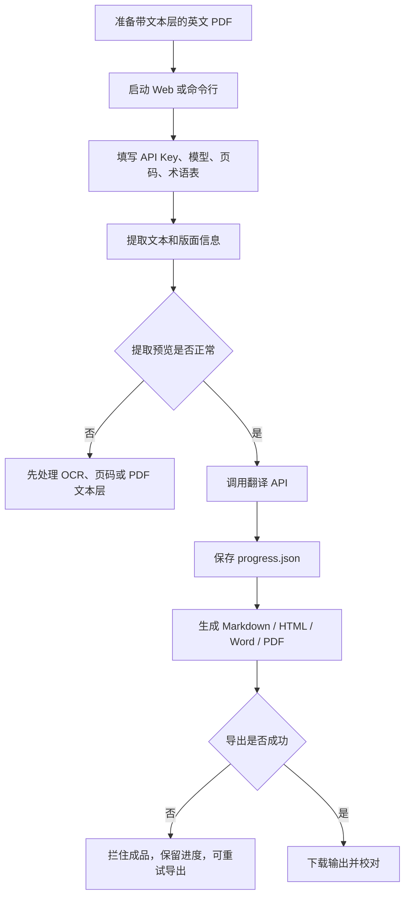
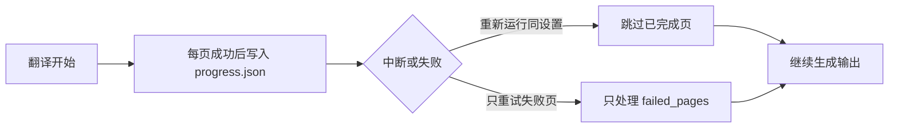
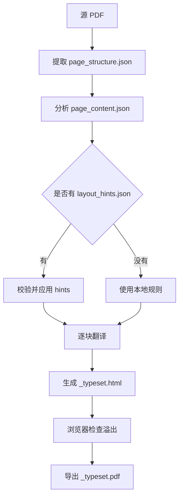

# Delta Green PDF Translator 使用手册

这是一个本地运行的 TRPG 英文文档中文翻译工具。它主要面向 Delta Green、规则书、模组、设定集这类带文本层、双栏排版、术语很多的 PDF，也支持 Markdown 和 Word 文档。

它会读取原文，按页或按块调用 DeepSeek 或其他 OpenAI 兼容接口翻译，再生成 Markdown、HTML、Word，或实验性的纯重绘 PDF。

注意：扫描版、纯图片 PDF 需要先做 OCR。本项目不负责 OCR。

## 你可以用它做什么

| 目标 | 推荐方式 | 输出 |
| --- | --- | --- |
| 第一次使用，想少配置 | Web 界面 | HTML / Word / Markdown |
| 翻译很长的 PDF | Web 或命令行 | HTML / Word / Markdown |
| 只重试失败页 | Web 高级任务控制或 `--retry-failed` | 原格式重新生成 |
| 翻译 Markdown | Web 上传 `.md` 或 `translate_md.py` | Markdown |
| 翻译 Word | Web 上传 `.docx` 或 `translate_docx.py` | Word |
| 尽量接近原 PDF 版面 | 纯重绘 PDF | `_typeset.pdf` |
| 不重新花钱，只重新生成输出 | 档案库“重试导出”或 `rerender_output.py` | HTML / Word / Markdown |

## 工作流总览



## 安装和启动

### 方法一：Windows 一键启动

适合大多数用户。

1. 安装 Python 3.10 或更新版本。
2. 解压或克隆本项目。
3. 双击：

```text
start_web.bat
```

第一次启动会自动创建 `.venv`、安装依赖，并打开 Web 服务：

```text
http://localhost:8501
```

### 方法二：手动启动 Web

```powershell
python -m venv .venv
.\.venv\Scripts\Activate.ps1
pip install -r requirements.txt
python -m streamlit run app.py
```

不要直接运行 `python app.py`。

### 方法三：命令行使用

先复制配置文件：

```powershell
copy config.example.json config.json
```

编辑 `config.json` 后运行。这个文件已被 `.gitignore` 忽略，不要把真实 API Key 写进示例文件。

```powershell
python translate_pdf.py --config config.json
```

也可以直接传参数：

```powershell
python translate_pdf.py "book.pdf" --api-key sk-xxx --glossary glossary.tsv --format all --workers 8
```

## Web 界面怎么用

Web 是推荐入口。它会保存上传文件、显示进度、生成审计记录，并在“档案库”里保留历史输出。

```text
┌────────────────────── 左侧任务参数 ──────────────────────┐
│ API Key                                                   │
│ 输出格式：Markdown / HTML / Word / 纯重绘 PDF             │
│ 页码范围、并发数、模型、Base URL                          │
│ 高级任务控制：重翻页码、只重试失败页、提取预览             │
│ 文档档案输出：Word 字号、行距、分栏、页眉                  │
│ 纯重绘配置：字体、layout_hints、自动审稿接口              │
└───────────────────────────────────────────────────────────┘

┌────────────────────── 主工作区 ──────────────────────────┐
│ 上传源文件和术语表                                       │
│ 查看提取预览                                             │
│ 执行翻译任务                                             │
│ 查看进度、费用、失败页                                   │
│ 下载成品                                                 │
│ 档案库：查看旧输出，导出失败时可重试导出                 │
└───────────────────────────────────────────────────────────┘
```

### 标准 Web 流程

1. 启动 Web。
2. 上传 PDF、Markdown 或 Word。
3. 填入翻译 API Key。
4. 选择输出格式。
5. 可选：上传术语表。
6. 可选：勾选“显示提取预览”，先检查 PDF 是否能正常读出文本。
7. 点击“执行翻译任务”。
8. 任务完成后下载成品。

### 页码怎么填

Web 里的 PDF 页码从 1 开始，和阅读器看到的页码更接近。

示例：

```text
起始页：1
结束页：10
```

表示翻译第 1 到第 10 页。

“重翻页码”支持：

```text
8, 12-15
```

表示只清理并重翻第 8、12、13、14、15 页。

## 命令行 PDF 翻译

### 配置文件示例

```json
{
  "pdf": "THE MILLENNIUM.pdf",
  "api_key": "sk-在这里填入你的 API Key",
  "glossary": "glossary.tsv",
  "provider": "deepseek",
  "base_url": "https://api.deepseek.com",
  "model": "deepseek-v4-pro",
  "format": "all",
  "workers": 8,
  "rate_limit": 60,
  "cooldown": 1.0,
  "fuzzy_matching": false,
  "start": 0,
  "end": null
}
```

### 常用命令

翻译整个 PDF：

```powershell
python translate_pdf.py "book.pdf" --api-key sk-xxx --format all
```

只翻译前 10 页。命令行页码从 0 开始，`--end` 不包含这一页：

```powershell
python translate_pdf.py "book.pdf" --api-key sk-xxx --start 0 --end 10
```

只输出 Word：

```powershell
python translate_pdf.py "book.pdf" --api-key sk-xxx --format word
```

使用 OpenAI 兼容接口：

```powershell
python translate_pdf.py "book.pdf" --api-key sk-xxx --base-url "https://你的接口/v1" --model "你的模型"
```

启用 OCR 字符容错术语匹配：

```powershell
python translate_pdf.py "book.pdf" --api-key sk-xxx --glossary glossary.tsv --fuzzy-matching
```

只重试失败页：

```powershell
python translate_pdf.py "book.pdf" --api-key sk-xxx --retry-failed
```

### 参数速查

| 参数 | 说明 |
| --- | --- |
| `pdf` | 输入 PDF 路径 |
| `--config` | JSON 配置文件 |
| `--api-key` | 翻译接口密钥 |
| `--output` | 输出路径，不需要写扩展名 |
| `--glossary` | 术语表路径 |
| `--provider` | 服务名，只用于进度指纹 |
| `--base-url` | OpenAI 兼容接口地址 |
| `--model` | 模型名 |
| `--format` | `markdown`、`html`、`word`、`both`、`all` |
| `--workers` | 并发数，范围 1 到 64 |
| `--rate-limit` | 每分钟最大 API 调用数 |
| `--cooldown` | 每批次之间的等待秒数 |
| `--start` | 起始页，从 0 开始 |
| `--end` | 结束页，不包含这一页 |
| `--retry-failed` | 只重试失败页 |
| `--fuzzy-matching` | 启用 OCR 字符容错术语匹配 |

## Markdown 和 Word 翻译

Web 可以直接上传 `.md`、`.txt`、`.docx`。

命令行也可以单独使用：

```powershell
python translate_md.py input.md --api-key sk-xxx --glossary glossary.tsv --workers 4
python translate_docx.py input.docx --api-key sk-xxx --glossary glossary.tsv --workers 4
```

Word 翻译默认不翻译页眉页脚。如需翻译：

```powershell
python translate_docx.py input.docx --api-key sk-xxx --translate-headers
```

## 输出文件说明

默认输出在 `output/`。每个任务会按文件名创建独立目录。

```text
output/
└─ book_cn/
   ├─ book_cn.md
   ├─ book_cn.html
   ├─ book_cn.docx
   ├─ book_cn.progress.json
   ├─ book_cn_extraction_report.md
   ├─ book_cn_glossary_report.md
   ├─ book_cn_audit.json
   └─ assets/
      ├─ book_cn_p0001_img1.png
      └─ ...
```

| 文件 | 作用 |
| --- | --- |
| `.md` | Markdown 译文 |
| `.html` | 浏览器阅读版 |
| `.docx` | Word 校对版 |
| `_typeset.pdf` | 纯重绘 PDF |
| `.progress.json` | 断点续跑和离线重排用的进度 |
| `_extraction_report.md` | PDF 提取诊断 |
| `_glossary_report.md` | 术语命中报告 |
| `_audit.json` | Web 任务审计记录 |
| `assets/` | 从 PDF 裁出的图片资源 |

## 术语表

术语表是 TSV 文件，也就是两列中间用 Tab 分隔。

格式：

```text
中文译名	英文原名
```

示例：

```text
绿色三角洲	Delta Green
旧日支配者	Great Old One
阿撒托斯	Azathoth
```

程序会先找当前页命中的术语，只把命中的术语发给模型，减少 token 占用。

如果 PDF 文字层有 OCR 损坏，可以启用模糊术语匹配。它会识别常见替换：

| OCR 错字 | 可能原字 |
| --- | --- |
| `0` | `O` / `o` |
| `1` | `l` / `I` / `i` |
| `5` | `S` / `s` |
| `8` | `B` / `b` |

Web 中勾选“模糊术语匹配”。命令行使用：

```powershell
python translate_pdf.py "book.pdf" --api-key sk-xxx --glossary glossary.tsv --fuzzy-matching
```

## 断点续跑、失败页和导出重试

翻译进度保存在 `.progress.json`。



### 什么时候会复用旧进度

以下设置一致时，会复用旧译文：

- PDF 文件
- 术语表
- 模型
- Base URL
- 页码范围
- 提示词版本
- 提取逻辑版本

如果不一致，程序会提示进度指纹不匹配，默认不复用旧译文。

### 失败页

失败页会写入 `failed_pages`，不会当作正常译文输出。

Web：勾选“只重试失败页”。

命令行：

```powershell
python translate_pdf.py "book.pdf" --api-key sk-xxx --retry-failed
```

### 导出失败重试

如果翻译成功但 HTML 或 Word 导出失败，Web 会拦住成品，并记录为 `export_failed`。

这时不要重新翻译。打开 Web 的“档案库”，点击“重试导出”。它会复用 `.progress.json`，只重新生成文件，不会调用翻译 API。

命令行也可以手动离线重排：

```powershell
python rerender_output.py --progress output\book_cn\book_cn.progress.json --pdf "book.pdf" --format all
```

只重新生成 HTML：

```powershell
python rerender_output.py --progress output\book_cn\book_cn.progress.json --pdf "book.pdf" --format html
```

## 纯重绘 PDF

纯重绘 PDF 会重新提取页面结构，用 HTML/CSS 重建页面，再导出 `_typeset.pdf`。它比普通 Word/HTML 更接近原 PDF 版面，但也更挑 PDF 结构。首次在 Web 里使用时，如果本机还没有对应浏览器内核，页面会先提示加载并显示进度。



### Web 使用方式

1. 上传 PDF。
2. 输出格式只选择“纯重绘 PDF（_typeset）”。
3. 如果页面提示加载浏览器内核插件，等待进度完成。
4. 如有需要，填写中文字体。
5. 如果已有 `layout_hints.json`，填入路径。
6. 如果要让多模态模型审稿，勾选“自动生成 layout hints”。
7. 点击执行。

### layout hints 的作用

`layout_hints.json` 只负责修正语义和阅读顺序，例如：

- 哪些块跳过翻译
- 哪些块属于左栏或右栏
- 哪些页是目录、正文、手册页、角色表或美术页
- 特殊页面的阅读顺序

它不负责生成坐标、字号或最终译文。

如果 `layout_hints.json` 的路径、页码或块 ID 错误，程序会直接失败，不会静默忽略。

### 多模态审稿接口

支持 Gemini 官方接口和 OpenAI 兼容多模态接口。

命令行实验脚本示例：

```powershell
python experiments/gemini_layout_review.py --provider gemini --api-key AIza... --model gemini-2.5-flash --pdf book.pdf --page-structure page_structure.json --page-content page_content.json --page 0 --output layout_hints.json
```

OpenAI 兼容接口：

```powershell
python experiments/gemini_layout_review.py --provider openai-compatible --api-key sk-xxx --base-url https://你的接口/v1 --model 你的视觉模型 --pdf book.pdf --page-structure page_structure.json --page-content page_content.json --page 0 --output layout_hints.json
```

## 打包分享

如果要把可运行项目发给别人，可以在项目根目录执行：

```powershell
powershell -ExecutionPolicy Bypass -File .\pack_release.ps1
```

它会在 `dist/` 生成 zip 包。

对方只需要：

1. 安装 Python 3.10 或更新版本。
2. 解压 zip。
3. 双击 `start_web.bat`。
4. 在网页里填自己的 API Key。

## 质量检查建议

翻译完成后建议重点检查：

| 检查项 | 正常表现 | 异常表现 |
| --- | --- | --- |
| 骰子记法 | `1D6`、`3D6` 保留 | 被翻成中文数字 |
| 属性缩写 | `STR`、`SAN`、`HP` 保留 | 被翻成普通词 |
| 术语 | 同一术语译法一致 | 同一词多种译名 |
| 页序 | 双栏阅读顺序正常 | 右栏跑到左栏前 |
| 图片 | 图片在 HTML/Word 中能看到 | 图片丢失 |
| 提示词泄露 | 没有内部翻译规则文字 | 出现“你是专业翻译”等内容 |
| 导出状态 | 审计记录为 completed | export_failed 或 failed |

## 常见失败案例与处理方式

| 失败情况 | 常见表现 | 处理方式 |
| --- | --- | --- |
| PDF 没有文本层 | 提取预览为空，输出没有正文 | 先用 OCR 工具把 PDF 处理成“可复制文字”的版本，再重新上传。 |
| 双栏顺序混乱 | 右栏内容跑到左栏前面，段落读起来不连贯 | 先用少量页测试；普通输出不满意时，改用纯重绘 PDF，复杂页再配 `layout_hints.json`。 |
| 页眉页脚混进正文 | 每页都反复出现书名、页码、章节栏 | 先看 `_extraction_report.md` 和质量检查的问题页；确认后只重翻受影响页。 |
| 表格错乱 | 表格变成散乱文字，或正文被当成表格 | 优先下载 HTML 或 Word 校对；如果是少数页，填写“重翻页码”后重跑。 |
| 图片没有回填 | HTML/Word 里看不到原图，或只有插图占位 | 检查输出目录里的 `assets/` 是否存在；缺图时重新运行，不要只复制单个 `.html` 或 `.docx`。 |
| API 调用失败 | 任务停住，出现 401、429、连接失败等错误 | 401 检查 API Key；429 降低并发或等待后重试；连接失败检查网络、代理和 Base URL。 |
| 断点续跑没有复用 | 重新运行后从头翻译，提示进度指纹不一致 | 确认 PDF、术语表、模型、Base URL、页码范围没有变化；变化后旧进度不会复用。 |
| 纯重绘 PDF 字体错误 | 中文乱码、缺字，或字体看起来不对 | 在纯重绘配置里填写本机已有中文字体，例如 `Microsoft YaHei`、`SimSun` 或 `Noto Serif SC`。 |

## 常见问题

### Web 页面打不开

先确认命令是否是：

```powershell
python -m streamlit run app.py
```

如果是双击启动，查看终端里是否显示：

```text
http://localhost:8501
```

### PowerShell 不能激活虚拟环境

当前窗口临时放开执行策略：

```powershell
Set-ExecutionPolicy -Scope Process -ExecutionPolicy Bypass
.\.venv\Scripts\Activate.ps1
```

### PDF 提取不到文字

大概率是扫描版 PDF。先用 OCR 工具生成带文本层的 PDF，再交给本项目。

### 翻译中断

直接用同样设置重新运行。程序会读取 `.progress.json`，跳过已完成页。

### 输出没有中文

程序会拦住这种结果，避免生成全英文成品。请检查：

- API Key 是否正确
- Base URL 是否正确
- 模型是否可用
- 页码范围是否有正文
- PDF 是否能提取文字

### 术语没有生效

检查术语表是否是：

```text
中文译名	英文原名
```

中间必须是 Tab。还要确认原文页里真的出现了英文术语。

### Word 导出失败

确认依赖已安装：

```powershell
pip install -r requirements.txt
```

如果 Web 里显示导出失败，可以去“档案库”点击“重试导出”。

### 纯重绘 PDF 有错位

先用少量页测试。复杂页面需要 `layout_hints.json` 辅助。不要让多模态模型直接生成坐标，只让它判断阅读顺序、块类型和跳过规则。

## 项目结构

```text
DGtranslate/
├─ app.py                         Web 界面入口
├─ translate_pdf.py               PDF 命令行入口
├─ translate_md.py                Markdown 翻译入口
├─ translate_docx.py              Word 翻译入口
├─ rerender_output.py             离线重新生成输出
├─ config.example.json            命令行配置模板
├─ glossary.tsv                   默认术语表
├─ core/                          提取、翻译、进度、术语、重绘管线
├─ exporters/                     Markdown、HTML、Word、typeset PDF 输出
├─ webui/                         Web 组件、历史、主题、运行时工具
├─ experiments/                   多模态 layout hints 实验脚本
├─ docs/                          精简指南和便携启动说明
├─ tests/                         自动测试
├─ uploads/                       Web 上传临时目录
└─ output/                        默认输出目录
```

## 开发者检查

运行全部测试：

```powershell
.\.venv\Scripts\python.exe -m pytest
```

语法检查：

```powershell
.\.venv\Scripts\python.exe -m py_compile app.py translate_pdf.py rerender_output.py
```

环境检查：

```powershell
.\.venv\Scripts\python.exe test_setup.py
```

## 使用提醒

本工具只适合个人学习、研究和私下校对。请尊重原书版权，不要公开分发或商业使用未经授权的译文。
